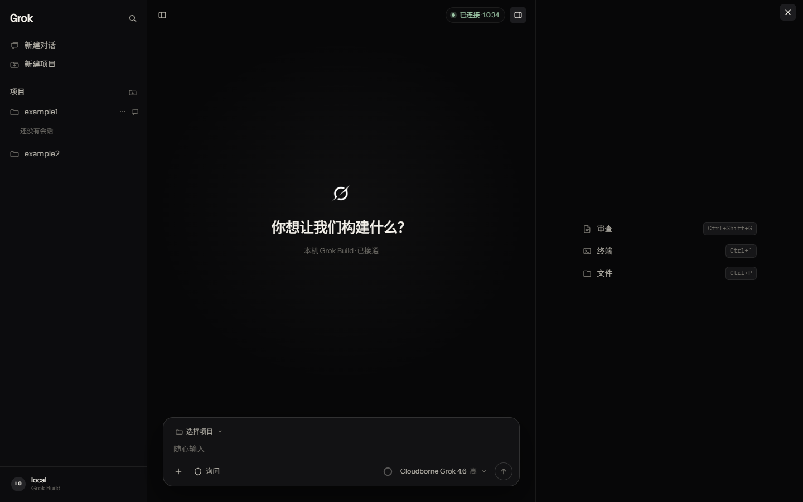
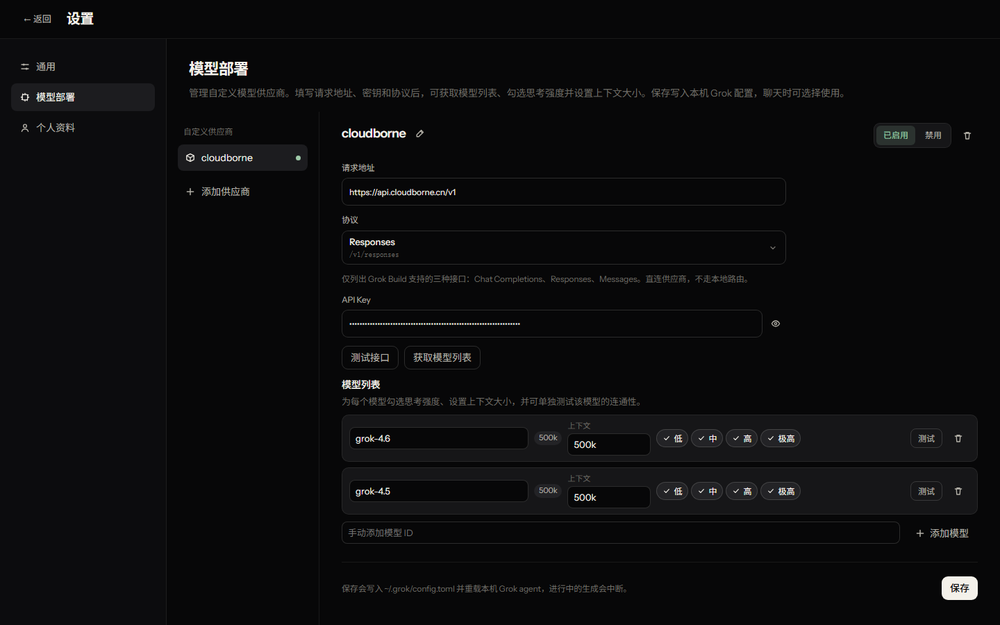
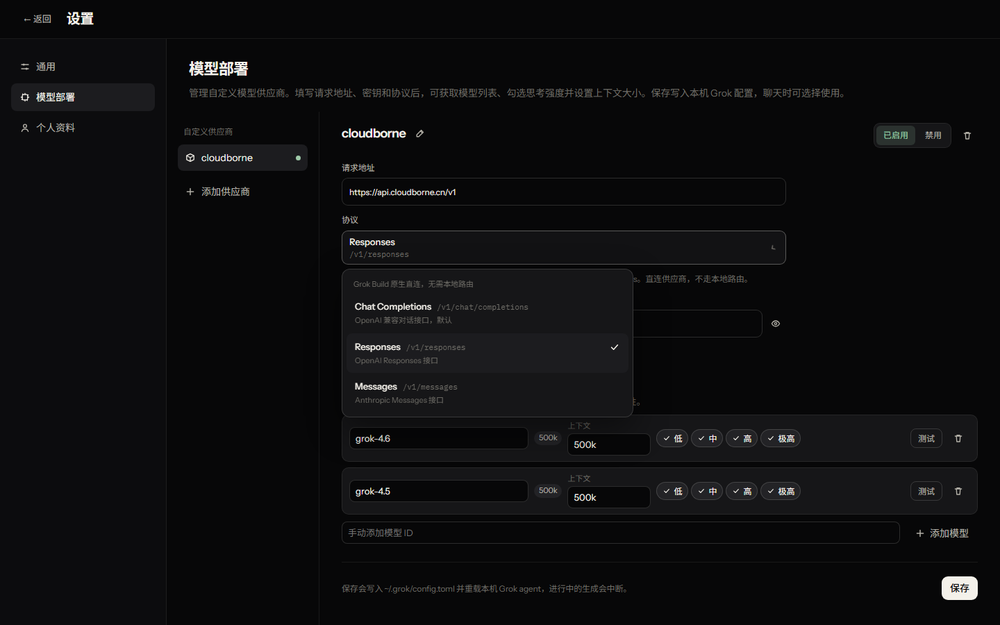

# Grok Build Web

本机 [Grok Build](https://x.ai) 的可视化操作台：左侧管项目和会话，中间是文档流对话，底部是输入坞，右侧可打开审查、终端和文件。

`npm run dev` 会拉起 `grok agent --no-leader stdio`，通过 ACP 把流式回复、工具调用、项目目录和 git 分支接到浏览器。

## 一键安装

需要 [Python 3](https://www.python.org/) 和 [Node.js](https://nodejs.org/) 20+。在仓库根目录执行：

```bash
python grok-build-web-install.py
```

Windows 也可以：

```text
py -3 grok-build-web-install.py
```

脚本会依次：

1. 查找本机 `grok`；找不到就运行官方安装脚本（Windows：`irm https://x.ai/cli/install.ps1 | iex`）
2. 确认 Node.js 20+ 和 npm
3. 在本仓库执行 `npm install`
4. 在桌面创建「Grok Build」快捷方式（Windows：`.lnk` 指向 `scripts/open-grok-build.ps1`；macOS / Linux：`Grok Build.command`）

完成后双击桌面快捷方式即可启动操作台（`http://127.0.0.1:5173/`）。自定义模型可在设置 → **模型部署** 里填请求地址和 API Key，不必先 `grok login`。

### 交给智能体（100 字以内）

> 克隆 https://github.com/qing-2114/grok-build-web.git ，在仓库根目录运行 python grok-build-web-install.py。脚本会检查或安装 Grok Build、确认 Node 20+、执行 npm install，并在桌面创建快捷方式。

## 你需要什么

- [Python 3](https://www.python.org/)（一键脚本）
- [Node.js](https://nodejs.org/) 20 或更高
- 本机 [Grok Build](https://x.ai) CLI，或让一键脚本代装（终端能执行 `grok --version`）
- Chromium 内核浏览器（文件夹选择器用得到）








## 部署

```bash
git clone https://github.com/qing-2114/grok-build-web.git
cd grok-build-web
python grok-build-web-install.py
```

或手动：

```bash
npm install
npm run dev
```

浏览器打开终端里的地址（默认 `http://127.0.0.1:5173/`）。顶栏应显示 **已连接** 和 Grok Build 版本号。

公开仓库首次打开会看到占位项目 `example1` / `example2`。点 **新建项目** 换成你自己的文件夹，或删掉这两个例子。

### 生产预览

```bash
npm run build
npm run preview
```

预览同样会挂 ACP 桥，只给本机用，不要把端口暴露到公网。

### 网络访问与安全

开发服务器和预览服务器默认只绑回环地址 `127.0.0.1`，并且 `/api/*` 前有一层守卫，只接受本机同源请求：

- 请求的 `Host` 必须是 `localhost` / `127.0.0.1` / `::1`（或下面显式放行的主机），否则返回 403
- 带 `Origin` 的请求必须与 `Host` 完全同源（含端口），`Origin: null` 与跨源页面一律 403
- 非 GET/HEAD 且带请求体的请求，`Content-Type` 必须是 `application/json`，否则返回 415

确需从别的机器访问（不建议）时用环境变量显式放行：

```bash
GROK_WEB_HOST=0.0.0.0 GROK_WEB_ALLOWED_HOSTS=192.168.1.50 npm run dev
```

`GROK_WEB_HOST` 是监听地址（默认 `127.0.0.1`），`GROK_WEB_ALLOWED_HOSTS` 是逗号分隔的额外放行主机名（可带端口）。放行后局域网内任何设备都能读写本机文件、读取 `~/.grok/config.toml` 里的明文 API Key，请自行判断风险。

### 桌面快捷方式

一键脚本会自动创建。Windows 手建时，目标：

```text
powershell.exe -NoProfile -ExecutionPolicy Bypass -WindowStyle Hidden -File "你的路径\grok-build-web\scripts\open-grok-build.ps1"
```

图标可用 `public/grok-icon.ico`。macOS / Linux 会生成 `Grok Build.command`，双击后启动 `npm run dev` 并打开浏览器。

## 现在能做什么

- **新建对话**：空画布，中间是 Grok 图标；第一条消息会在对应项目目录下创建一条 grok 会话
- **新建项目**：用系统文件夹选择器或手动填写路径；有 git 时才出现分支芯片
- **项目列表**：点击展开该项目下的会话；`...` 可编辑项目或删除全部聊天
- **会话区**：文档流（标题 + 正文 + 工具卡片），不是聊天气泡；暂停生成；等候队列
- **输入坞**：项目、git 分支（会真实 `checkout`）、权限（询问 / 计划 / 自动 / 始终批准）、模型 + 思考强度、附件、斜杠命令
- **模型部署**：设置里添加自定义供应商（请求地址、API Key、协议）。协议为 Grok Build 原生直连的 Chat Completions / Responses / Messages，无需本地路由。可获取模型列表、勾选思考强度、设置上下文；**测试接口**只验 Key 能否连通地址，每个模型可单独测推理
- **右侧栏**：审查当前文件夹的 git 更改；在会话目录打开集成终端（Windows 检测 PowerShell / Command Prompt / Git Bash / WSL，macOS / Linux 检测 zsh / bash / fish / sh）；浏览并预览文件（代码高亮、Markdown、PDF、Word）
- **文件链接**：对话里的路径单击即可在右侧预览；网页用 Ctrl/⌘+单击在系统浏览器打开
- **侧栏宽度**：左右侧栏都可以拖动；双击边缘恢复默认宽度

## 没连上时

界面会显示 **本机未连接**，发送会失败并提示。请确认：

1. 本机 Grok Build CLI 已配置好（`grok --version` 可用）
2. 重启 `npm run dev` 后再硬刷新（Ctrl+F5）

## 界面约定

- 文档流而不是聊天气泡；用户消息是右对齐胶囊
- 权限：询问 / 计划 / 自动 / 始终批准
- 有 git 的项目才显示分支芯片
- 生成中可暂停；再输入发送会进入等候列表
- 右侧栏用可关闭的标签打开文件，不是固定三个按钮

项目和个人资料存在浏览器 `localStorage` 键 `grok-build-web.v5`。会话正文由本机 grok 存在 `~/.grok/sessions`。自定义模型写在 `~/.grok/config.toml`。
