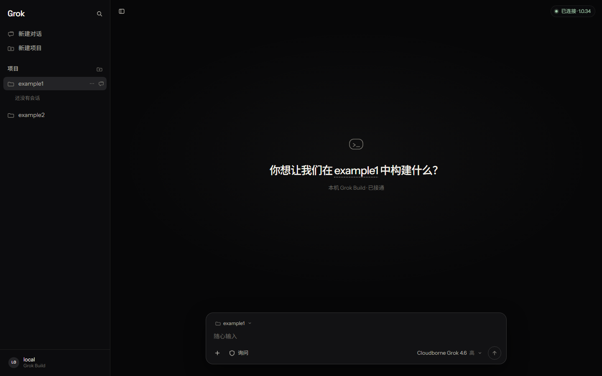

# Grok Build Web

本机 [Grok Build](https://x.ai) 的可视化操作台：左侧管项目和会话，中间是文档流对话，底部是输入坞。

`npm run dev` 会拉起 `grok agent --no-leader stdio`，通过 ACP 把流式回复、工具调用、项目目录和 git 分支接到浏览器。



## 你需要什么

- [Node.js](https://nodejs.org/) 20 或更高
- 已安装并登录的 [Grok Build](https://x.ai) CLI（终端里能跑 `grok --version`）
- Chromium 内核浏览器（文件夹选择器用得到）

## 部署

```bash
git clone https://github.com/qing-2114/grok-build-web.git
cd grok-build-web
npm install
npm run dev
```

浏览器打开终端里的地址（默认 `http://localhost:5173/`）。顶栏应显示 **已连接** 和 Grok Build 版本号。

首次打开会看到占位项目 `example1` / `example2`。点 **新建项目** 换成你自己的文件夹，或删掉这两个例子。

### 生产预览

```bash
npm run build
npm run preview
```

预览同样会挂 ACP 桥，不要把端口暴露到公网。这是给本机 `127.0.0.1` 用的操作台。

### 桌面快捷方式（Windows）

仓库里有 `scripts/open-grok-build.ps1`。可在桌面建快捷方式，目标：

```text
powershell.exe -NoProfile -ExecutionPolicy Bypass -WindowStyle Hidden -File "你的路径\grok-build-web\scripts\open-grok-build.ps1"
```

图标可用 `public/grok-icon.ico`。点开后会启动 `npm run dev` 并打开浏览器。

## 没连上时

界面会显示 **本机未连接**，发送会失败并提示。请确认：

1. `grok --version` 能跑
2. 已经 `grok login`（或本机默认模型有可用密钥）
3. 重启 `npm run dev` 后再硬刷新（Ctrl+F5）

## 界面约定

- 文档流而不是聊天气泡；用户消息是右对齐胶囊
- 权限：询问 / 计划 / 自动 / 始终批准
- 有 git 的项目才显示分支芯片
- 生成中可暂停；再输入发送会进入等候列表

项目和个人资料存在浏览器 `localStorage` 键 `grok-build-web.v5`。会话正文由本机 grok 存在 `~/.grok/sessions`。

给代理看的说明在 `AGENTS.md`。
